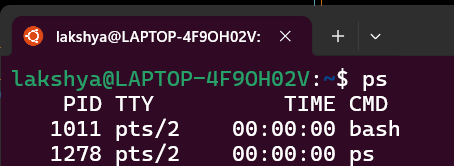
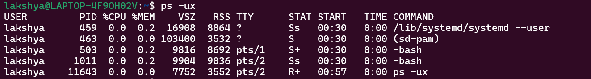
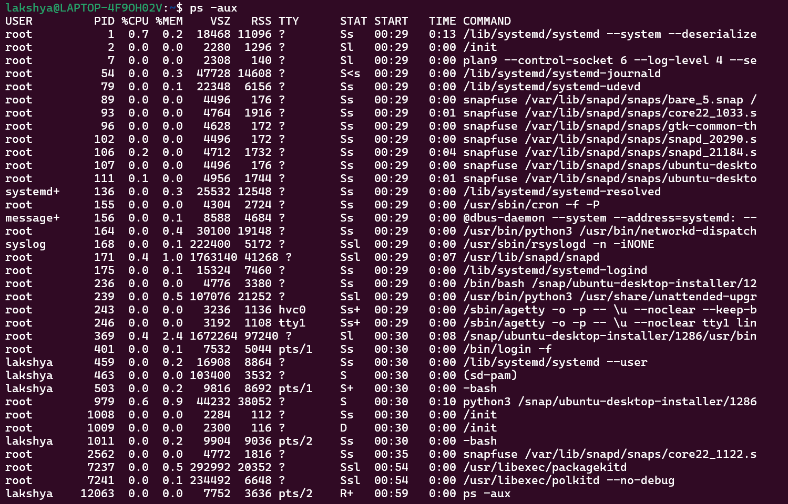

# ps Command Examples

## How to use ps command

here's the syntax of the ps command:-

```
ps [options] 
```

Here,
* ` [options] ` is used to fine-tune the output of the ps command as per your needs such as you can use the `-u` flag and append a username to it and display processes specific to that user.

|Option|Description|
|--------------------|-----------------------------------------------------------------------------|
|`-e`|Show all processes, including those not associated with a terminal.|
|`-f`|Show full process information, including arguments.|
|`-u <username>`|Show processes owned by a specific user.|
|`-x`|Show processes without a controlling terminal.|
|`-o <PID/USER/CMD/%CPU/%MEM>`|Specify output format (PID, user, command, CPU usage, memory usage).|
|`--sort=<parameter>`|Sort output by different parameters.|


<br>When we run mormal `ps` command without any options, it will only show the processes attached to the current terminal:<br>

<br><br>

## Some other ps commands
+ To get detailed information about each process
    ```
        ps -ux
    ```
    
<br><br>
+ To show the running processes of every user
    ```
        ps -ux
    ```
    

